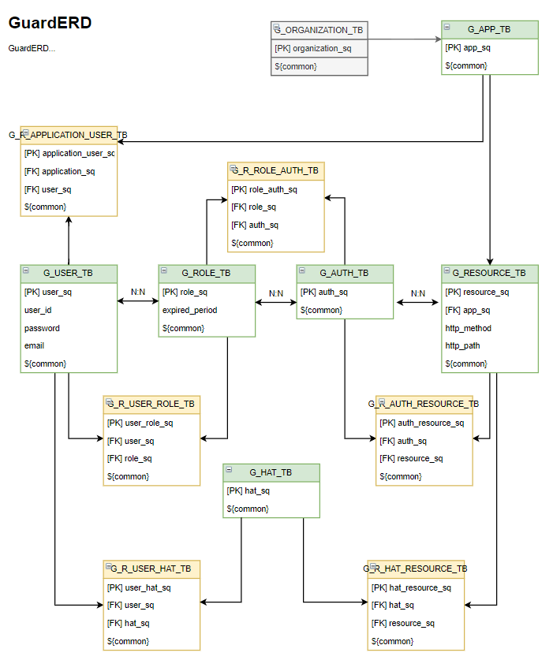
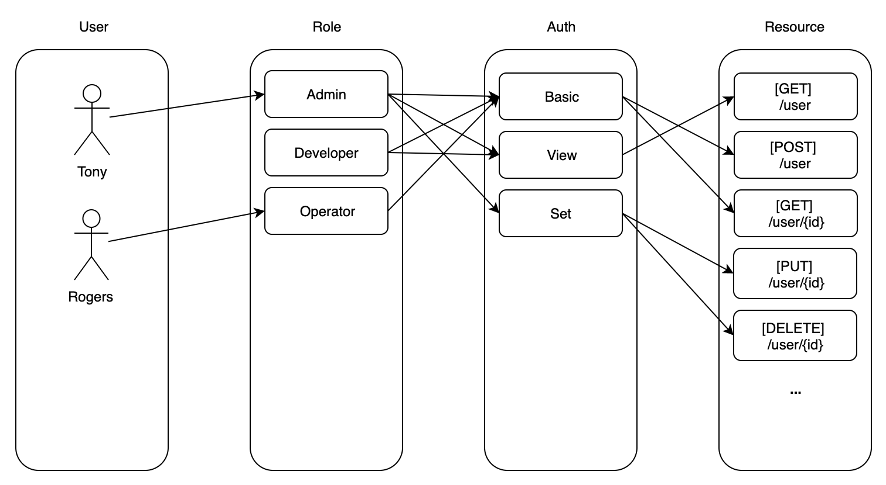

# GUARD

###### Project MO

## 정의

`Guard` 는 말 그대로 문지기를 뜻합니다. 

문지기로써 ProjectMO(Micro + Operation) 영역에 접근이 가능한지 판단하는 정보는 관리하고 제공합니다.

`Guard` 는 ProjectMO에서 기본이 되는 데이터인 `1. 조직 및 서비스 정보` 와 `2. 유저 및 권한` 을 관리합니다.

단, `Guard`에서 ProjectMO의 `인증 및 인가`를 직접 처리하지 않습니다.

별도의 Gateway와 OAuth2 서버가 존재하며 Gateway나 OAuth2 서버가 필요에 따라 Guard 서비스에게 관련 정보를 요청합니다.

따라서 Gateway와 OAuth2 서버의 요청 외에는 별도의 관리자 페이지에서만 Guard의 데이터를 관리할 수 있습니다. 

> Gateway나 OAuth2 서버가 DB에 직접 연결되서 데이터를 처리하는 것도 네트워크 처리량을 줄이는 방법이 될 수 있으나, 
>
> MSA 플랫폼의 목적에 따라 데이터를 관리하는 Guard 서버를 별도로 구성하였습니다.
>
> Guard는 Gateway나 OAuth2 서버에 종속적이지 않습니다. 독립적으로 구성이 가능합니다. 

## 인프라구조

Guard 는 위의 사진과 같은 인프라 구조를 가지고 있습니다.

실제 클라이언트가 Guard 에 접근하는 경우는 2가지입니다.

> 1. 인증

클라이언트가 인증을 위하여 Gateway에 인증 요청을 보냅니다. 

Gateway의 인증 요청 경로는 ProjectMO 플랫폼에서 유일하게 ALL_OPEN 인 경로입니다.

Gateway에 인증요청이 들어오면 OAuth2 서버에 해당 정보를 전달하고 

OAuth2 서버는 Guard에게 유저정보를 전달하여 유효한 계정인지 확인합니다.

만약 유효한 계정이라면 OAuth2 는 유저 정보가 담긴 JWT를 발급하여 인증을 유지합니다.

> 2. 인가

클라이언트가 인증을 마쳤다면 JWT를 가지고 있을 것이고 JWT의 내부 authorities 항목에는 클라이언트가 가지고 있는 권한정보가 있습니다.

클라이언트가 JWT를 가지고 Gateway에 보호자원이 있는 경로에 요청을 보냅니다.

Gateway의 Filter는 Guard에서 전달받은 자원은 권한정보를 대조하여 권한이 있는 유저인지 판별합니다.

여기서 Gateway는 보호 자원에 대한 권한 정보를 캐싱하고 있습니다. 

따라서 데이터가 변경되지 않는한 권한 정보를 요청하진 않습니다.

**정보는 캐싱하고 권한 정보의 변경을 인지하는 부분에 메시지큐인 `Kafka`를 사용할 예정입니다.**

**Guard에서 권한의 정보가 변경된다면 메세지큐를 통해서 Gateway에게 권한이 변경된 것을 인지시키고 데이터를 최신화하는 방식입니다.** 

Guard는 중요정보를 관리하는 서비스이기 때문에 보안에 민감합니다.

1. OAuth2 를 통해 인증을 진행할 때 
2. Gateway가 자원의 권한 정보를 요청할 때

접근이 가능하며 별도로 Guard의 CRUD는  `인증된 유저(admin)`만 접근이 가능하도록 구성할 예정입니다.

따라서, OAuth서버에서 요청하는 인증 및 인가에 필요한 API와 관리자 페이지에서 필요한 CRUD API를 제공하고 있습니다.

자세한 부분은 Swagger를 통한 API 명세에서 확인이 가능합니다. [API 명세서 주소(준비중)](http://google.com)

( 현재 별도의 Console 페이지는 준비되지 않음 )

## 데이터구조

### Role

유저에게 역할을 부여하는데 3가지 구성정보가 필요합니다.

- Role
- Auth
- Resource

### Hat

권한을 얻는 방법으로 2가지가 있습니다.

1. Role(역할)을 부여 받아 권한을 얻는 방법
2. Hat(임시역할)을 부여 받아 권한을 얻는 방법 - 임시적인방법

발급된 권한은 다시 회수하기가 어렵습니다.

 따라서 Hat이라는 비즈니스 로직을 추가하여 임시 권한 부여에 사용하도록 추가 하였습니다. (AWS Hat 기능 참조)

## 기능

- 유저 & 권한 API
- 조직 & 서비스 API
- 아이디찾기 & 패스워드찾기
- 명세서 다운로드 & 업로드 기능

## 진행상황

- RESTful API 개발
- RESOURCE class 설계는 아직 진행하지 않음
 - RESOURCE class 설계시에 공통화가능할지
- 보안연동 (OAuth2)
